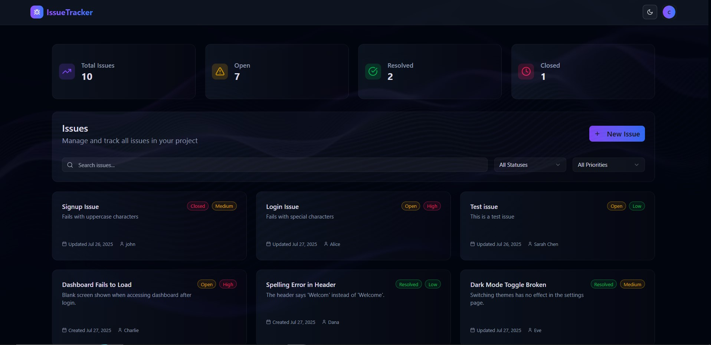

#  IssueTracker

A full-stack Issue Tracker web application that allows users to perform **CRUD operations** on issues, built with **React (Vite + TypeScript)** on the frontend and **Express.js** with **MongoDB** on the backend.

---

##  Features

-  Create, Read, Update, and Delete issues
-  Track issue status - Open, Resolved, Closed
-  Assign priority levels
-  View detailed information of individual issues
-  Authentication
-  Filter/search issues by title, priority
-  Responsive modern UI


---

##  Dashboard



---

##  Tech Stack

### Frontend
-  React (Vite + TypeScript)
- Tailwind CSS
- Axios
- Zustand
- Shadcn

### Backend
- Node.js + Express.js
-  MongoDB + Mongoose
- JWT for authentication

---

##  Project Structure
```
IssueTracker/
├── Frontend/
│   ├── src/
│   └── ...
├── Backend/
│   ├── models/
│   ├── routes/
│   ├── controllers/
│   ├── middleware/
│   ├── config/
│   └── ...
└── README.md
```


---

##  Core Functionalities

- Create new issues with title, description, severity, and priority
- List all issues with summary info
- View detailed issue information
- Edit/update issue details
- Mark issues as Resolved or Closed
- User authentication
- Search/filter issues
- Modern responsive UI


---

##  Installation & Setup

### 1. Clone the Repository

```bash
git clone https://github.com/Sithija-R/Issue_Tracker.git
```

### 2. Setup & Run Backend

```bash
cd Backend
npm install
npm run dev 

```
### 3. Setup & Run Frontend

```bash
cd Frontend
npm install
npm run dev

```
# API Documentation
##  Auth API


### 1. User Registration
POST `API_BASE_URL/user/register`


Request Body: JSON
```json
{
  "name": "John Doe",
  "email": "john@example.com",
  "password": "************"
}
```
### 2. User Login
POST `API_BASE_URL/user/login`


Request Body: JSON
```json
{
  "email": "john@example.com",
  "password": "************"
}
```
##  Issues API

### 1. Create Issue  
POST `API_BASE_URL/issue/create`  

Headers:  `Authorization: Bearer <token>`

Request Body: JSON  
```json
{
  "title": "Issue title",
  "description": "Detailed description",
  "priority": "High",   
  "status": "Open",    
  "assignee": "Alice"  
}
```

### 2. Update Issue  
PUT `API_BASE_URL/issue/update`  

Headers:  `Authorization: Bearer <token>`

Request Body: JSON  
```json
{
  "title": "Issue title",
  "description": "Detailed description",
  "priority": "High",   
  "status": "Open",    
  "assignee": "Alice"  
}
```
### 3. Get All Issues  
GET `API_BASE_URL/issue/all`  

### 4. Delete Issue  
DELETE `API_BASE_URL/issue/delete/:id`  

Headers:  `Authorization: Bearer <token>`
